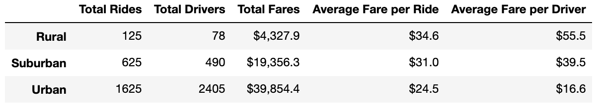
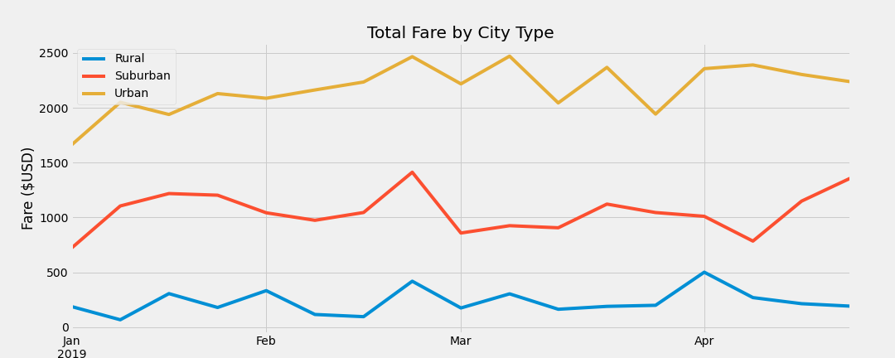

# PyBer_Analysis
Creating visualizations with Pandas

## Overview of Pyber Analysis
The intent of this analysis was to identify Pybers market performance across 3 different city types: Rural, Suburban, and Urban. To gauge true profitability, we looked at a variety of variables to determine outcomes such as:
-Total number of drivers
-Total fares by city types
-Average fare per city
-Average fare per driver

These are just a few of the different areas Pyber is looking into performance

## Results

When looking at the summary analysis, we can see a few things:

Although Rural city types have by far the least amount of drivers, they are actually the most profitable compared to Suburban and Urban drivers. This is a factor of limited number of rides, but also due to probably greater distance traveled. Drivers in this type of city setting have more ground/road to cover compared to urban drivers. Urban drivers will probably tend to focus on the number of rides as a way to generate profitability. Suburban drivers are somewhere in the middle. But this does not tell the whole story. This is simply looking at the averages.

When we look at trends over the past year we see a few things:

We can see that total fare by city type is actually relatively flat for rural city types. When compared to Suburban and Urban, these city types have been able to increase their total fare since the beginning of the year. Ony hypothesis is due to the inflow of new residents or visitors to those type of city types. Rural cities tend to be older and dormit communities, while Urban and Suburban communities tend to be more transient.

## Summary & Recommendations
Based on these findings there are a few recommendations for Pyber:
-I would expand the Suburban outreach of drivers. This appears to be a growing segment of the business when looking at total fares by city type of the past year
-second, i would look for ways to enhance the Urban driver experience. One aspect they did not disclose is the type of service. Potentially offering premium service could boost fares in urban settings
-As far as rural city, i would look to explore expanding that segment as well. Given the average fare drivers are having, there is an opportunity to expand the workforce there as far as driver share.
